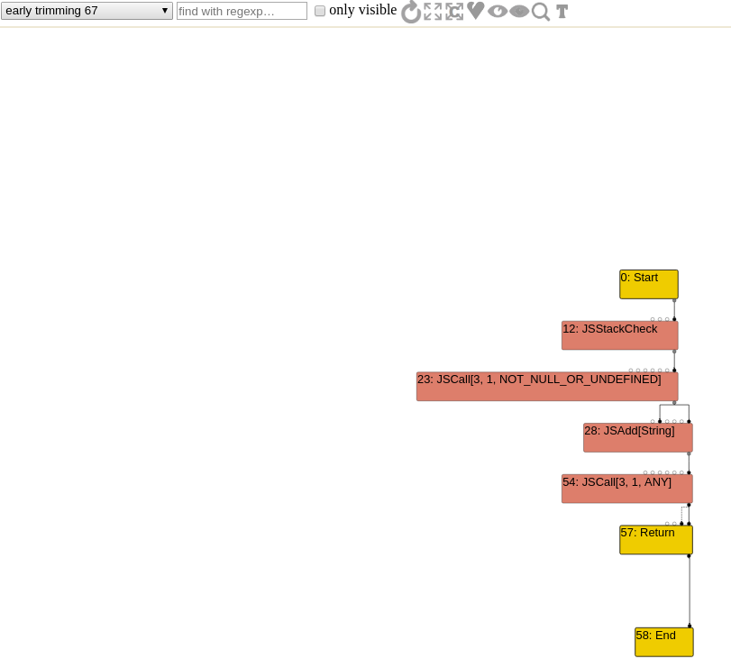
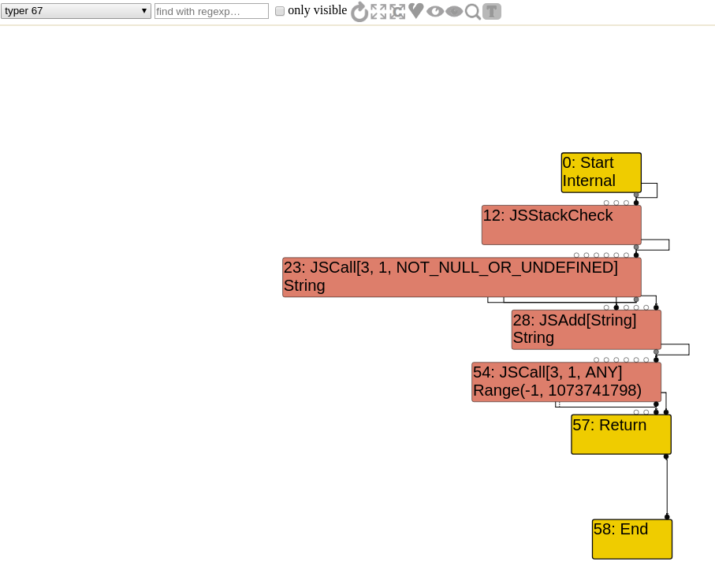

# Understanding the bug

```c++
Type* Typer::Visitor::JSCallTyper(Type* fun, Typer* t) {

// [...]

  case kStringLastIndexOf:
    return Type::Range(-1.0, String::kMaxLength - 1.0, t->zone());

// [...]
}
```

For `JSCall` nodes to `StringLastIndexOf`, the typer computes a range going from -1 to `kMaxLength - 1`, which is not correct because of the following behaviour:

```text
d8> "ABC".lastIndexOf('')
3
```

Indeed, `lastIndexOf` and `indexOf` can return up to `length`, not `length - 1`. If the string length were to be `kMaxLength`, `lastIndexOf` would return `kMaxLength` instead of `kMaxLength - 1`.

Thefore, there might be a desynchronization between the actual return value and the range computed by the typer.

# Triggering the bug

For the following code, TurboFan is going to generate a `JSCall` node during graph creation.
The typer is going to associate an incorrect `Range` type to this `JSCall`;

```javascript
// 64-bit : kMaxLength is 1073741799
// 32-bit : kMaxLength is 268435440
let opt_me = (pwn) => {
  var str = "____"+"DOARE".repeat(214748359);
  var idx = String.prototype.lastIndexOf.call(str, ''); // JSCall | Range(0, 1073741798)
  if (pwn) {
    print(idx); 
  }
}
```

Let's observe that the actual idx value is 1073741799;

```text
$ dd8 opt_me.js --trace-turbo
Concurrent recompilation has been disabled for tracing.
---------------------------------------------------
Begin compiling method opt_me using Turbofan
---------------------------------------------------
Finished compiling method opt_me using Turbofan
1073741799
```

And compare the graphs before and after typing to confirm there is an incorrect range of `[-1,1073741798]`.

# Graph before typing



# Typed graph


